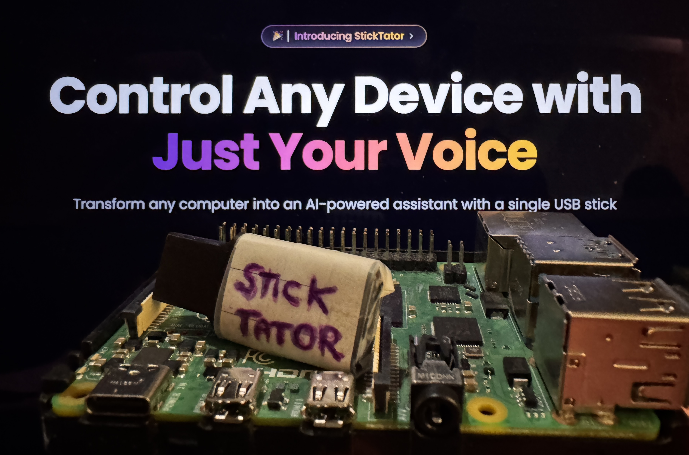

# ✨ StickTator ✨

### A USB stick that lets you chat with any computer and control it through simple conversations

    

        <a href="CONTRIBUTING.md">Demo</a> •
        <a href="./docs/running-locally.md">Running this app locally</a> •
        <a href="./docs/resources.md">Resources</a> 
    

## 👨‍💻 Author

[Aryan Khurana](https://github.com/AryanK1511)
